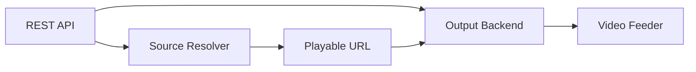
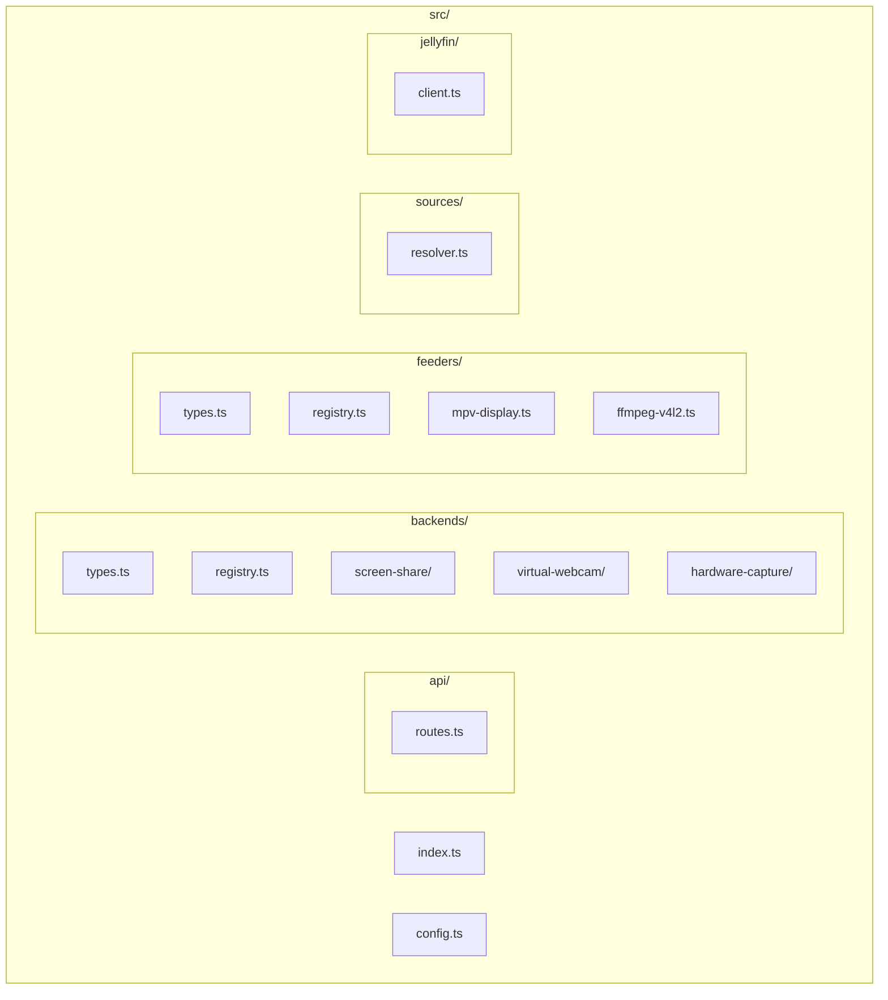

# Discarr Architecture

This document describes the internal architecture for developers taking over or extending the project.

## Overview

Discarr streams video to Discord voice channels via a REST API. The system uses a pluggable architecture so different output methods (screen share, virtual webcam, hardware capture) can be added without rewriting core logic.

## Directory Structure

| Path | Purpose |
|------|---------|
| `index.ts` | Entry point, Express app, shutdown handling |
| `config.ts` | Environment/config loading with Zod validation |
| `api/routes.ts` | REST endpoints: /health, /play, /stop, /status, etc. |
| `backends/types.ts` | OutputBackend interface, Target type |
| `backends/registry.ts` | Factory: creates backend from OUTPUT_MODE config |
| `backends/screen-share/` | Implemented: Xvfb + Discord web + screen share |
| `backends/virtual-webcam/` | Stub: v4l2loopback (future) |
| `backends/hardware-capture/` | Stub: real /dev/video* (future) |
| `feeders/types.ts` | VideoFeeder interface |
| `feeders/registry.ts` | Selects feeder by target type |
| `feeders/mpv-display.ts` | Implemented: MPV → X11 display |
| `feeders/ffmpeg-v4l2.ts` | Stub: FFmpeg → v4l2 (future) |
| `sources/resolver.ts` | Resolves local/url/jellyfin → playable path |
| `jellyfin/client.ts` | Jellyfin API: parse URL, get stream URL |

## Key Abstractions

### OutputBackend

Defines how video reaches Discord. Each backend implements:

- `prepare()` – Ensure Discord session ready (browser, join channel)
- `getTarget()` – Returns what the feeder should deliver to (display, v4l2 device, etc.)
- `startStream()` / `stopStream()` – Begin/end sharing
- `shutdown()` – Cleanup

Selected via `OUTPUT_MODE` in config.

### Target

Describes the destination for video:

- `{ type: "display", display: ":99" }` – X11 display (screen share)
- `{ type: "v4l2", device: "/dev/video0" }` – Virtual webcam
- `{ type: "hardware", device: "/dev/video2" }` – Physical capture device

### VideoFeeder

Delivers video to the target. Each feeder implements `supportsTarget()` and `feed()`. The registry selects the first feeder that supports the backend’s target.

## Request Flow: Play

1. API receives `POST /play` with `{ source, path? | url? | jellyfinUrl? }`
2. **Source resolver** produces a playable path/URL (Jellyfin URLs → stream URL via API)
3. **Backend** is prepared (e.g., Discord controller joins channel)
4. **Backend** starts stream (e.g., screen share button clicked)
5. **Feeder** is selected from target; `feed(playableUrl, target)` runs
6. For screen share: MPV plays on Xvfb display; Discord shares that display

## Configuration

All config comes from environment variables (and `.env`). See `config.example.env`. Validation is done with Zod in `config.ts`.

## Extending the System

### Adding a new output backend

1. Implement `OutputBackend` in `src/backends/<name>/index.ts`
2. Add case to `createBackend()` in `registry.ts`
3. Add `OUTPUT_MODE` value to config schema

### Adding a new video feeder

1. Implement `VideoFeeder` in `src/feeders/<name>.ts`
2. Add to the `feeders` array in `createFeederForTarget()` in `registry.ts`

### Adding a new source type

1. Extend the play request schema in `api/routes.ts`
2. Add handling in `sources/resolver.ts`
