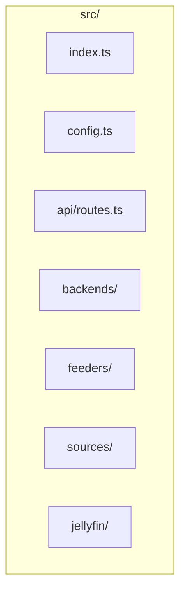

# Discarr

Stream video to Discord voice channels. Supports screen share (Linux container), with future support for virtual webcam and hardware capture.

**Repository:** [https://github.com/StevenGann/Discarr](https://github.com/StevenGann/Discarr)

**Documentation:** [ARCHITECTURE.md](ARCHITECTURE.md) (internals) | [CONTRIBUTING.md](CONTRIBUTING.md) (development)

## Features

- **REST API** – Control playback via HTTP
- **Multiple sources** – Local files, URLs, Jellyfin
- **Pluggable backends** – Screen share (implemented), virtual webcam (planned), hardware capture (planned)

## Quick Start

### Docker Image

Pre-built images are published to [GitHub Container Registry](https://github.com/StevenGann/Discarr/pkgs/container/discarr):

```bash
docker pull ghcr.io/stevengan/discarr:latest
```

Images are built on push to `main`/`master` and on version tags (e.g. `v0.1.0`).

### Prerequisites

- Node.js 18+ (for local development)
- Docker and Docker Compose (for deployment)
- Discord account (dedicated account recommended)
- Linux host (for Docker deployment)

### Setup

1. Clone the repository and configure:

```bash
git clone https://github.com/StevenGann/Discarr.git
cd Discarr
cp config.example.env .env
# Edit .env with your Discord server ID, voice channel ID, and optional Jellyfin settings
```

2. Get Discord IDs (enable Developer Mode in Discord settings first):

   - Right-click server → Copy ID → `DISCORD_SERVER_ID`
   - Right-click voice channel → Copy ID → `DISCORD_VOICE_CHANNEL_ID`

3. Create directories:

```bash
mkdir -p discord-profile videos
```

4. Build and run:

```bash
docker compose up -d
```

### First-Time Discord Login

Discord requires manual login the first time. Use one of these options:

**Option A: QR code (recommended, no VNC)** – Open `http://localhost:3000/login-qr` in a browser. Scan the QR code with the Discord mobile app (You → Settings → Scan QR Code). The session is saved automatically.

**Option B: Run with VNC** (see docs for VNC setup) to access the browser and log in.

**Option C: Run locally** (without Docker) to log in, then copy the profile:

```bash
npm install
npm run dev
# In another terminal, use the API - the first play will open Firefox
# Log in to Discord when prompted, then stop the app
# Copy the discord-profile folder into your project for Docker
```

The `discord-profile` volume persists your Discord session.

### API Reference

| Method | Endpoint | Description |
|--------|----------|-------------|
| GET | `/health` | Health check; returns status, outputMode, platform |
| GET | `/login-qr` | Discord login QR code (PNG image); scan with Discord mobile app |
| GET | `/status` | Current playback state (stopped/playing/paused) |
| POST | `/play` | Start playback. Body: `{ source, path? \| url? \| jellyfinUrl? }` |
| POST | `/stop` | Stop playback |
| POST | `/pause` | Pause playback |
| POST | `/resume` | Resume playback |

### API Usage

```bash
# Health check
curl http://localhost:3000/health

# Play from URL
curl -X POST http://localhost:3000/play -H "Content-Type: application/json" \
  -d '{"source":"url","url":"https://example.com/video.mp4"}'

# Play from local path (relative to /videos in container)
curl -X POST http://localhost:3000/play -H "Content-Type: application/json" \
  -d '{"source":"local","path":"movie.mp4"}'

# Play from Jellyfin (requires Jellyfin config in .env)
curl -X POST http://localhost:3000/play -H "Content-Type: application/json" \
  -d '{"source":"jellyfin","jellyfinUrl":"https://jellyfin.example.com/web/index.html#!/itemdetails.html?id=abc123"}'

# Stop
curl -X POST http://localhost:3000/stop

# Status
curl http://localhost:3000/status
```

### SMB / Network Shares

Mount the share on the host, then bind mount into the container:

```bash
# On host: mount SMB share
sudo mount -t cifs //server/share /mnt/videos -o credentials=/etc/smb-credentials

# In docker-compose.yml, add volume:
# - /mnt/videos:/videos
```

## Configuration

| Variable | Description |
|----------|-------------|
| `OUTPUT_MODE` | `screen_share` (default), `virtual_webcam`, or `hardware_capture` |
| `PLATFORM` | `linux` or `windows` |
| `DISCORD_SERVER_ID` | Discord server ID |
| `DISCORD_VOICE_CHANNEL_ID` | Voice channel to stream to |
| `DISCORD_PROFILE_PATH` | Path for persistent Firefox/Discord profile |
| `JELLYFIN_SERVER_URL` | Jellyfin server URL (optional) |
| `JELLYFIN_API_KEY` | Jellyfin API key (optional) |
| `JELLYFIN_USER_ID` | Jellyfin user ID for playback (optional) |
| `VIDEOS_PATH` | Base path for local videos (default: /videos) |

## Development

```bash
npm install
npm run dev
```

Requires Xvfb and Firefox when running screen share locally:

```bash
Xvfb :99 -screen 0 1280x720x24 &
export DISPLAY=:99
npm run dev
```

## Architecture

- **OutputBackend** – How Discord receives video (screen share, virtual webcam, etc.)
- **VideoFeeder** – Delivers video to the backend (MPV→display, FFmpeg→v4l2)
- **Source Resolver** – Resolves local/URL/Jellyfin to playable path

See [ARCHITECTURE.md](ARCHITECTURE.md) for detailed internals. See [CONTRIBUTING.md](CONTRIBUTING.md) for development setup.

## Project Structure



## Troubleshooting

| Issue | Possible fix |
|-------|--------------|
| Discord login required every run | Ensure `discord-profile` volume is mounted and persists. Do first login manually via VNC or local run. |
| "DISCORD_SERVER_ID must be set" | Add both `DISCORD_SERVER_ID` and `DISCORD_VOICE_CHANNEL_ID` to `.env`. |
| Video/audio lag or stutter | Xvfb is software-rendered. Consider GPU passthrough or lower resolution. |
| Discord UI selectors broken | Discord may have updated. Check `discord-controller.ts` selectors (aria-label, data-list-item-id). |
| Jellyfin "not configured" | Set `JELLYFIN_SERVER_URL`, `JELLYFIN_API_KEY`, and `JELLYFIN_USER_ID`. |

## License

MIT

---

**Discarr** – [https://github.com/StevenGann/Discarr](https://github.com/StevenGann/Discarr)
